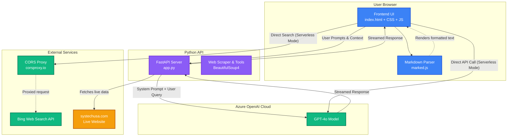

# Systech Chatbot Architecture

Here is the high-level technical architecture of the custom Systech AI Chatbot. The application can run in two primary modes: a **Direct-to-Azure Serverless Mode** (running entirely in the browser) and a **Python Backend Mode** (using a custom middle-tier).

## High-Level Architecture Diagram

## Core Components

### 1. Frontend (`index.html`)
The frontend is a lightweight, dependency-free vanilla HTML/JS/CSS application. It provides:
- **Floating Chat UI:** A modern, responsive chat interface overlaying the website (or an iframe of the website).
- **Streaming Support:** It natively handles Server-Sent Events (SSE) to render the AI's response in real-time as it's generated, giving a fluid, fast user experience.
- **Markdown Rendering:** It utilizes `marked.js` to parse the raw text coming from the AI into beautifully formatted HTML (headers, bullet points, links, etc.).

### 2. Python Backend (`app.py`)
This is the powerful middle-tier built using **FastAPI** (`uvicorn`). It serves as the brain orchestrating the chatbot's advanced capabilities:
- **System Instructions:** It injects a highly customized, robust system prompt containing formatting rules, company leadership, product details, and URLs.
- **Web Scraping:** It uses `BeautifulSoup4` and `urllib` to execute real-time scraping of `systechusa.com` (like reading the live Careers page) so the AI never hallucinates outdated information.
- **Secure Integration:** It securely holds your Azure API keys so they are never exposed to the public internet via the browser.

### 3. Azure OpenAI & Bing
- **GPT-4o:** The core Large Language Model that processes user requests and synthesizes the data.
- **Bing Search:** Used for generalized internet searches (especially in the serverless mode) to answer questions outside the scope of the pre-programmed website data.

## Technology Stack & Libraries

### Frontend Libraries
* **HTML5 / CSS3 / Vanilla Javascript:** Used for building the lightweight, responsive chat interface directly into the browser without needing a heavy frontend framework like React or Angular.
* **[marked.js](https://marked.js.org/):** A low-level compiler for parsing markdown text. When the AI returns text formatted with bolding, lists, or headers, `marked.js` safely converts this raw text into HTML elements so they render beautifully in the chat bubble.

### Backend (Python) Libraries
* **[FastAPI](https://fastapi.tiangolo.com/):** A modern, incredibly fast web framework for building APIs in Python. It handles all incoming requests from the frontend, manages the routing (like the `/chat` endpoint), and handles asynchronous operations perfectly, which is critical for streaming AI responses.
* **[Uvicorn](https://www.uvicorn.org/):** An ASGI web server implementation for Python. This is the actual server engine that runs and hosts your FastAPI application on port 8000.
* **[OpenAI Python SDK](https://github.com/openai/openai-python):** The official library used to securely connect to the Azure OpenAI cloud. It allows the backend to easily send prompts, handle tool calling, and receive the streaming response chunks back from the GPT-4o model.
* **[Azure Identity](https://pypi.org/project/azure-identity/):** Provides Azure Active Directory (Azure AD) token authentication. This ensures your connection to the Azure OpenAI endpoints is highly secure and authenticated.
* **[BeautifulSoup4 (bs4)](https://pypi.org/project/beautifulsoup4/):** A powerful library for pulling data out of HTML and XML files. It acts as the core of the chatbot's custom web scraper—fetching live Systech pages, stripping away unwanted code (like headers/footers/scripts), and extracting pure text so the AI can read it.
* **urllib:** Python's built-in module for fetching URLs (used in tandem with BeautifulSoup to scrape live pages or query the WordPress Search API).

## Request Flow Example
When a user asks **"What are the open jobs?"**:
1. The user types the message in the Frontend UI.
2. The UI sends a POST request to `app.py`.
3. `app.py` bundles the request with the system prompt and sends it to Azure OpenAI.
4. The AI realizes it needs to read the Careers page, so it triggers the Python web scraper.
5. `app.py` fetches `https://systechusa.com/careers/` and feeds the raw HTML text back to the AI.
6. The AI analyzes the text, writes a response, and streams it back through `app.py` to the Frontend.
7. The Frontend renders the response word-by-word into the chat bubble!
